# Character Relationship Maps

**Purpose**: Visual and narrative mapping of key relationships in Mike Burns's life story, organized to reveal dramatic potential, emotional complexity, and thematic resonance.

---

## Core Relationship: Mike Burns (Hoomothya) at Center

All relationships radiate from Mike Burns, the protagonist whose journey from Hoomothya to Mike Burns to witness defines the novel.

---

## ACT I: HOOMOTHYA (Childhood - 1865-1872)

### Primary Relationships

**MOTHER** → Hoomothya
- **Nature**: Nurturing, cultural teacher, primary attachment
- **Emotional Core**: Love, safety, belonging, Yavapai identity
- **Key Moments**: Daily life, cultural education, final moments before massacre
- **Dramatic Function**: Represents everything Hoomothya loses
- **Thematic Significance**: Cultural continuity severed
- **[NEEDS CULTURAL CONSULTATION**: Naming, specific cultural practices]

**FATHER** → Hoomothya
- **Nature**: Provider, protector, role model
- **Emotional Core**: Pride, masculine identity, Yavapai manhood
- **Key Moments**: Hunting/gathering, teaching survival skills, death at Skeleton Cave
- **Dramatic Function**: Lost future—who Hoomothya would have become
- **Thematic Significance**: Interrupted cultural transmission
- **[NEEDS CULTURAL CONSULTATION**: Naming, father-son practices]

**SIBLINGS** → Hoomothya
- **Nature**: Companions, playmates, family bonds
- **Emotional Core**: Childhood joy, belonging, ordinary love
- **Key Moments**: Play, daily routines, all killed at Skeleton Cave
- **Dramatic Function**: Normal childhood destroyed
- **Thematic Significance**: Innocence murdered
- **[HISTORICAL QUESTION**: Number and ages of siblings? Mike's writings?]

**GRANDFATHER** → Hoomothya
- **Nature**: Elder, storyteller, cultural knowledge keeper
- **Emotional Core**: Wisdom, tradition, Yavapai history
- **Key Moments**: Stories, teachings, death at Skeleton Cave (Mike found "part of his head in rock hole")
- **Dramatic Function**: Severed generational knowledge
- **Thematic Significance**: Cultural genocide made personal
- **Historical Detail**: Mike specifically mentioned finding grandfather's remains

**GRANDMOTHER, UNCLE, AUNT** → Hoomothya
- **Nature**: Extended family, Yavapai social structure
- **Key Moments**: All killed at Skeleton Cave
- **Dramatic Function**: Total family annihilation
- **Thematic Significance**: No one left who knew him as Hoomothya

### Community Relationships

**YAVAPAI BAND MEMBERS** → Hoomothya
- **Nature**: Community, cultural belonging, shared identity
- **Emotional Core**: Security of being known, understood, valued
- **Key Moments**: Daily life, celebrations, final moments in cave
- **Dramatic Function**: World that existed before genocide
- **Thematic Significance**: Cultural context Mike loses

**CHIEF NANNI-CHADDI** → Hoomothya's people
- **Nature**: Leader killed at Skeleton Cave
- **Historical Detail**: Said no soldier would find his stronghold
- **Dramatic Function**: Failed protection, tragic irony
- **Thematic Significance**: Leadership unable to prevent destruction

---

## TRANSITIONAL TRAUMA (December 1872)

### The Soldiers Who Destroyed His World

**U.S. ARMY PATROL** → Hoomothya (Age ~8)
- **Relationship**: Captors (December 22, 1872)
- **Emotional Experience**: Terror, confusion, vulnerability
- **Power Dynamic**: Absolute power over helpless child
- **Dramatic Function**: First violence, first loss of agency

**CAPTAIN JAMES BURNS** → Hoomothya (December 22-28, 1872)
- **First Encounter**: Captor (Dec 22)
- **Terrible Moment**: Forces boy to lead soldiers to cave (Dec 28)
- **After Massacre**: Adopts the child he orphaned
- **Relationship Type**: MOST COMPLEX IN NOVEL
  - Destroyer AND savior
  - Enemy AND adoptive father
  - Captor AND protector
  - The man who orphaned Mike AND gave him his name
- **Emotional Layers**:
  - Terror → confusion → complicated attachment → unresolved grief (Burns died 1874)
  - Can never be resolved—Burns dies before Mike can process
  - Mike inherits Burns's name but not his answers
- **Dramatic Potential**: The relationship that makes no sense but defines Mike's life
- **Thematic Core**: Colonization's personal face—violence intertwined with "care"

**CAPTAIN WILLIAM H. BROWN** → Hoomothya (December 28, 1872)
- **Relationship**: The killer (led Skeleton Cave assault)
- **Emotional Experience**: Witness to massacre, helpless observer
- **Key Moment**: Voice ordering the firing, the efficient slaughter
- **Mike's Connection**: Probably never knew Brown's name as child—learned it later from records
- **Dramatic Function**: Faceless violence made systematic
- **Thematic Significance**: Banality of military evil

**GENERAL GEORGE CROOK** → Hoomothya (Indirect, 1872)
- **Relationship**: Distant architect of destruction
- **Child's Awareness**: Wouldn't know Crook's name, only feel impact
- **Later Understanding**: Mike learns Crook ordered the campaign
- **Evolution**: Abstract enemy → military employer (scout service) → complex historical figure
- **Dramatic Arc**: Understanding grows with Mike's age

### Witnesses and Survivors

**MARICOPA AND PIMA SCOUTS** → Hoomothya
- **Relationship**: Indigenous people who helped soldiers kill other Indigenous people
- **Complexity**: Tribal politics, survival strategies, colonial violence
- **Mike's Perspective**: Fellow Indians who participated in his family's destruction
- **Thematic Significance**: Colonization divides Indigenous peoples

**CARLOS MONTEZUMA** (Mike's cousin) → Survivor relationship
- **Connection**: Both survived Skeleton Cave as children
- **Montezuma's Story**: Found nearly suffocated under dead mother's body
- **Parallel Lives**: Both educated, both became advocates (different paths)
- **Dramatic Potential**: Shared trauma, different responses
- **[RESEARCH NEEDED**: Did they ever meet? Correspond? Know each other?]

---

## ACT II: MIKE BURNS (Transformation - 1872-1908)

### Institutional Relationships

**CAPTAIN HALL S. BISHOP** → Mike Burns (1874-1880?)
- **Relationship**: Second military guardian after Captain Burns died
- **Function**: Continuation of military custody
- **Emotional Significance**: Another authority figure, not chosen father
- **Dramatic Role**: Transition to Carlisle
- **[RESEARCH NEEDED**: Duration and nature of this relationship]

**RICHARD HENRY PRATT** → Mike Burns (1880-1885)
- **Relationship**: Carlisle superintendent, architect of assimilation
- **Power Dynamic**: Total institutional control
- **Complexity**:
  - "Civilizer" who demanded cultural death
  - Educator who gave Mike literacy (tool he'd use for witness)
  - True believer who thought erasure was salvation
- **Mike's Performance**: Model student, successful assimilation (outwardly)
- **Hidden Resistance**: Hoomothya survived inside despite Pratt's system
- **Emotional Layers**:
  - Can't fully hate the man who taught him to write his story
  - Can't forgive the system that tried to erase Hoomothya
  - Ambiguity Mike carries to his grave
- **Dramatic Function**: Educational violence, forced identity split
- **Thematic Core**: Using master's tools (literacy) against the master (witnessing)

**CARLISLE STUDENTS** → Mike Burns (1880-1885)
- **Relationship Type**: Fellow survivors of cultural erasure
- **Shared Experience**: Forced assimilation, hidden resistance, trauma bonding
- **Potential Characters**:
  - Friend who also hides tribal self
  - Student who fully embraces assimilation (conflict)
  - Girl Mike cares about (romance subplot potential)
  - Student from another tribe (intertribal connection)
- **Dramatic Function**: Mike not alone in his split identity
- **[HISTORICAL RESEARCH**: Were there documented Carlisle friendships? Other Yavapai students?]

**WHITE TEACHERS/STAFF** → Mike Burns (1880-1885)
- **Relationship Types**:
  - Those who show unexpected kindness
  - Those who are particularly cruel
  - Those who are merely indifferent
- **Power Dynamic**: Absolute authority over students
- **Dramatic Function**: Individual faces of institutional violence

### Military Service Relationships

**U.S. ARMY OFFICERS** → Mike Burns (1885-1888)
- **Relationship**: Employers during scout service
- **Terrible Irony**: Mike serves army that killed his family
- **Power Dynamic**: Military hierarchy, racial subordination
- **Complexity**: Professional respect vs. racial prejudice
- **Emotional Weight**: Every order carries ghosts

**FELLOW SCOUTS** → Mike Burns (1885-1888)
- **Relationship**: Apache and other tribal scouts
- **Shared Experience**: Indigenous men serving colonial military
- **Complexity**:
  - Professional camaraderie
  - Shared understanding of impossible position
  - Possible judgment: some may view Mike as traitor
  - Or solidarity: all doing what they must to survive
- **Dramatic Potential**: Conversations about identity, loyalty, survival
- **[RESEARCH NEEDED**: Documented accounts from scouts of this era?]

**WHITE SOLDIERS** → Mike Burns (1885-1888)
- **Relationship**: Served alongside, subordinate to
- **Range of Attitudes**:
  - Respect for Mike's skills
  - Racism and contempt
  - Ignorance and indifference
- **Dramatic Function**: Daily experience of racial marginalization

### Community and Identity Relationships

**YAVAPAI SURVIVORS** → Mike Burns (Post-1875)
- **Relationship**: Complicated reconnection
- **Potential Tensions**:
  - Mike raised by white soldiers
  - Mike educated at Carlisle
  - Mike served as Army scout
  - Some may see him as lost to the people
  - Others may see him as survivor who adapted
- **Emotional Core**: Longing for belonging + fear of rejection
- **Dramatic Function**: Can Mike come home to a people he was forced to leave?
- **[CRITICAL CULTURAL CONSULTATION NEEDED]: How would Yavapai community view Mike?]

**FORT MCDOWELL YAVAPAI COMMUNITY** → Mike Burns (1934)
- **Relationship**: Final home, return to people
- **Significance**: Dies among Yavapai, not alone
- **Dramatic Function**: Partial homecoming, incomplete resolution
- **Thematic Significance**: Identity reclaimed at life's end

---

## ACT III: THE WITNESS (Elder Writing Truth - 1908-1934)

### Advocacy and Witness Relationships

**SHARLOT HALL** → Mike Burns (1910-1934?)
- **Relationship**: Historian Mike trusts with his story
- **Initial Contact**: January 6, 1910 letter seeking publication help
- **Power Dynamic**: Mike as supplicant, Hall as gatekeeper
- **Complexity**:
  - Hall preserves manuscript (crucial)
  - But doesn't/can't publish it during Mike's life (painful)
  - Did she try and fail? Or not try hard enough?
  - Mike dies without seeing his story published
- **Emotional Arc**:
  - Hope (1910 letter)
  - Waiting (1910-1934)
  - Dying unpublished (1934)
  - Posthumous publication (2010/2012)
- **Dramatic Function**: Witness seeking witness, gatekeeping of history
- **Thematic Significance**: Whose stories get told? Who decides?

**ARIZONA TERRITORY/U.S. GOVERNMENT** → Mike Burns (1908)
- **Relationship**: First Native American registered to vote in Arizona (July 15, 1908)
- **Significance**: Citizenship as both victory and bitter irony
- **Complexity**:
  - Proves he's "American enough"
  - But based on Burke Act requiring land ownership and "civilization"
  - Recognition within the system that destroyed his people
- **Dramatic Function**: Assimilation's costs and compromises
- **Thematic Significance**: What does citizenship mean when your people were genocided?

**YOUNGER GENERATION YAVAPAI** → Elder Mike Burns
- **Relationship**: Mike as keeper of memory, teacher
- **Function**: Passing on what he knows before it's lost
- **Dramatic Potential**: What does he teach? What does he hide?
- **Thematic Significance**: Cultural survival through witness

**READERS (Future, Unknown)** → Mike Burns as Writer (1934)
- **Relationship**: Writing for people he'll never meet
- **Faith Required**: Trusting his words will outlive him
- **Dramatic Function**: Ultimate act of witness
- **Emotional Core**: Dying before seeing impact, dying before being heard
- **Thematic Significance**: Story survives even when teller doesn't

---

## RELATIONSHIP PATTERNS & THEMATIC CLUSTERS

### Pattern 1: POWER & POWERLESSNESS

**Hoomothya** (Age 8):
- Captured by soldiers → Powerless
- Forced to lead them to cave → Powerless, complicit through coercion
- Watches family die → Powerless witness
- Taken by Captain Burns → Powerless dependent

**Mike Burns** (Young man):
- Carlisle student → Institutional powerlessness
- Must perform assimilation → Powerless over identity
- Army scout → Limited agency within hierarchy
- Navigates white society → Structural powerlessness

**Mike Burns** (Elder):
- Writes his story → Claims narrative power
- Seeks publication → Still dependent on gatekeepers (Sharlot Hall)
- Dies unpublished → Story powerless until 2010
- **BUT**: Story survives → Ultimate power of witness

### Pattern 2: SPLIT IDENTITIES & RELATIONSHIPS

**Hoomothya ↔ Mike Burns** (Internal relationship):
- Constant tension between selves
- Neither can be fully abandoned
- Language split: Yavapai thoughts in English words
- Cultural split: Yavapai worldview in American context
- The relationship with himself is central drama

**People who knew only Mike**:
- Carlisle teachers, white society, some Army colleagues
- Relate to performed identity, not full self
- Mike must hide Hoomothya to survive

**People who knew Hoomothya**:
- All dead except cousin Carlos Montezuma (maybe)
- No one left who remembers him as Yavapai child
- Must reconstruct Hoomothya alone in memory

### Pattern 3: DESTROYER/SAVIOR PARADOX

**Captain James Burns**:
- Destroyer (orphaned Mike) + Adoptive father
- Can't be purely hated or purely loved
- Dies before relationship can be understood
- Mike inherits his name, not his answers

**Richard Henry Pratt**:
- Cultural destroyer (assimilation system) + Educator (gave Mike literacy)
- Mike uses Carlisle skills to witness against genocide
- Hate the system, ambiguous about the man?

**General George Crook**:
- Ordered campaign that killed Mike's family + Some Apache respected him
- Later employed scouts including Mike
- Distant but omnipresent in Mike's life

### Pattern 4: WITNESS RELATIONSHIPS

**Mike ↔ His dead family**:
- They can't speak; he must speak for them
- Burden of being "the only one living to tell"
- Survivor's guilt: why him?
- Obligation to remember accurately

**Mike ↔ Sharlot Hall**:
- Mike trusts her with witness
- She preserves but doesn't publish
- Complicated legacy: saved story, but Mike died unheard

**Mike ↔ Future readers** (us):
- We read words he died without seeing published
- 76+ years late
- His witness finally heard
- But he never knew we'd listen

---

## RELATIONSHIP DEVELOPMENT ACROSS THREE ACTS

### ACT I: BELONGING → ANNIHILATION
- Hoomothya has family, community, culture, identity
- Relationships are Yavapai-centered, culturally grounded
- December 1872: Every primary relationship violently severed
- Orphaned physically and culturally

### ACT II: FORCED RELATIONSHIPS → SURVIVAL PERFORMANCE
- Relationships imposed (Captain Burns, Pratt, Army)
- Mike must perform acceptable identity to survive
- Authentic connections rare, risky
- Hoomothya hidden in relationships built on Mike Burns performance

### ACT III: RECLAMATION → WITNESS
- Returns to Yavapai community (Fort McDowell)
- Reclaims Hoomothya while keeping Mike
- Writing becomes relationship with truth
- Final relationship: with us, the readers he never met

---

## DRAMATIC USES OF RELATIONSHIPS

### Conflict Sources
- Mike vs. assimilation system (Pratt, Carlisle)
- Mike vs. military authorities
- Mike vs. internalized shame/trauma
- Mike vs. historical erasure (Sharlot Hall failure to publish)
- Hoomothya vs. Mike Burns (internal conflict)

### Emotional Anchors
- Lost mother: grief, cultural connection
- Lost family: survivor guilt, witness obligation
- Captain Burns: unresolvable complexity
- Fellow students/scouts: survival strategies, solidarity
- Sharlot Hall: hope and disappointment

### Thematic Expressions
- Family relationships → cultural genocide's personal cost
- Institutional relationships → systemic violence
- Witness relationships → power of story to survive

---

## RESEARCH PRIORITIES FOR RELATIONSHIP DEVELOPMENT

**Critical Cultural Consultation**:
- [ ] Yavapai naming practices for family members
- [ ] Appropriate representation of family relationships
- [ ] Cultural protocols for depicting deceased relatives
- [ ] Yavapai community perspectives on Mike's life choices

**Historical Research**:
- [ ] Did Mike Burns and Carlos Montezuma ever connect?
- [ ] Documented friendships from Carlisle years?
- [ ] Relationships with other Yavapai survivors?
- [ ] Letters/correspondence with anyone besides Sharlot Hall?
- [ ] Marriage? Children? (Not found in initial research)

**Fiction Opportunities** (gaps in record):
- Carlisle friendships and alliances
- Relationships during Army scout service
- Fort McDowell community connections (1934)
- Mike's internal relationship with Hoomothya

---

**[NOTE: All relationship characterizations must serve Mike Burns's journey and honor his witness. Cultural consultation required before finalizing any Yavapai family/community relationships. Fiction fills gaps but never contradicts documented evidence or cultural protocols.]**

---

## RELATIONSHIP TIMELINE MAPPING

### PHASE 1: Childhood as Hoomothya (c. 1865-1872) - Age 0-7

**Primary Relationships (All Lost)**:
- Mother (killed by soldiers pre-Dec 1872): Nurturing, cultural teacher, primary attachment
- Father (killed at Skeleton Cave, Dec 28, 1872): Provider, protector, transformed by mother's death to "bitter vengeance"
- Grandfather (killed at Skeleton Cave): Elder, storyteller, cultural keeper - Mike later found "part of his head in rock hole"
- Grandmother, Uncle, Aunt (killed at Skeleton Cave): Extended family structure
- Siblings/Cousins (killed at Skeleton Cave): Playmates, companions
- Yavapai band members (76-100 killed): Community, cultural belonging

**Status**: Total annihilation - all severed simultaneously on December 28, 1872

---

### PHASE 2: Captivity & Forced Adoption (Dec 22, 1872 - 1880) - Age 8-15

**NEW Imposed Relationships**:

**Captain James Burns (1872-1874)** - *THE DEFINING RELATIONSHIP*
- December 22, 1872: Captures 8-year-old Hoomothya
- December 22-28: Forces child to lead soldiers to cave
- December 28: Present at massacre of child's entire family
- Post-Dec 28: Adopts the child he orphaned
- Renames Hoomothya as "Mike Burns"
- Died 1874 (Mike age ~9)
- **Relationship type**: Captor/adoptive father, destroyer/savior paradox
- **Emotional impact**: Unresolvable complexity - gratitude and rage forever intertwined
- **Legacy**: Mike carries Burns's name and unresolved questions to his grave

**Captain Hall S. Bishop (1874-1880?)**
- Second military guardian after Burns died
- Transition figure to Carlisle
- Less documented, less emotionally central than Burns
- **Relationship type**: Institutional guardian, military authority

**Military/White Society (1872-1880)**
- Learning English, suppressing Yavapai language
- Navigating white social structures
- **Relationship type**: Forced assimilation, survival performance

**Internal Relationship: Hoomothya ↔ Mike Burns**
- BEGINS during this phase
- Hoomothya doesn't die; he goes underground
- Mike Burns is performed identity; Hoomothya is hidden self
- **This split becomes permanent internal relationship**

---

### PHASE 3: Carlisle Industrial School (1880-1885) - Age 15-20

**Institutional Authority**:

**Richard Henry Pratt (1880-1885)** - Superintendent
- "Kill the Indian, save the man" philosophy
- Total institutional control over Mike's life
- Architect of forced assimilation system
- Provided education (literacy tools Mike later uses for witness)
- **Relationship type**: Cultural destroyer who gave Mike the weapon (literacy) to fight back
- **Emotional complexity**: Can't fully hate the man who taught him to write his truth; can't forgive the system

**Carlisle Teachers & Staff**
- Range from cruel to kind to indifferent
- Daily enforcers of assimilation
- **Relationship type**: Institutional power, cultural erasure

**Peer Relationships**:

**Carlisle Students (1880-1885)**
- Fellow Native students from various tribes
- Shared trauma, shared resistance
- Secret language-speaking, cultural preservation in hidden moments
- Possible friendships, romantic interests (undocumented but likely)
- **Relationship type**: Survival solidarity, between-worlds companionship
- **[FICTION OPPORTUNITY]**: Create 2-3 specific student relationships to show Mike's Carlisle experience

**Status**: Educational violence, institutional control, but also peer solidarity and literacy acquisition

---

### PHASE 4: Higher Education (1885-1886) - Age 20-21

**Highland University, Kansas (1885-1886)**
- One year of higher education
- Minimal documentation
- **[RESEARCH GAP - FICTION OPPORTUNITY]**: What relationships formed? Why only one year?

---

### PHASE 5: U.S. Army Scout Service (1885-1888) - Age 20-23

**Two Enlistments**: July 1885-Dec 1885 (5-6 months), June 1887-Dec 1888 (18 months)

**Military Relationships**:

**U.S. Army Officers**
- Employers, commanders
- Mike serves the army that killed his family
- Range from respectful (of skills) to racist
- **Relationship type**: Professional hierarchy within colonial violence
- **Emotional weight**: Every order echoes with ghosts

**Fellow Indian Scouts**
- Apache, Yavapai, other tribal scouts
- Shared moral compromise: Indigenous men hunting Indigenous peoples
- Operations against Sitting Bull, Geronimo
- Possible: silent understanding, drinking together, shared guilt
- Possible: judgment of each other as traitors
- **Relationship type**: Complicated solidarity in impossible position
- **[RESEARCH NEEDED]**: Documented scout accounts, specific individuals

**White Soldiers**
- Served alongside, subordinate to
- Daily racism, occasional humanity
- Mike remains outsider despite uniform
- **Relationship type**: Professional proximity, social exclusion

**The Hunted (Apache, other Native peoples)**
- Mike tracks them using traditional skills
- When they see his brown skin in Army uniform: mutual recognition, mutual judgment
- **Relationship type**: Tragic mirror - Mike sees what he's become

**Internal Crisis**:
- Hoomothya ↔ Mike Burns split deepens
- Compartmentalization to survive moral weight
- Guilt accumulates with each mission

---

### PHASE 6: The "Lost Years" (1889-1908) - Age 24-43

**[MAJOR RESEARCH GAP - SIGNIFICANT FICTION OPPORTUNITY]**

**Yavapai Survivors & Community**
- Attempting reconnection with Yavapai people
- Possible tensions: Was he accepted? Judged for being scout? Both?
- Learning about who survived, what was lost
- **Relationship type**: Complicated homecoming, partial belonging
- **[CRITICAL CULTURAL CONSULTATION NEEDED]**: How would community view Mike?

**Arizona Territory Society**
- Navigating as neither fully white nor fully "Indian" in white eyes
- Employment relationships (unknown specifics)
- Social marginalization
- Citizenship attempts (multiple rejections before 1908)

**Judge Ed. W. Wells (by 1908)**
- Friend Mike votes for in 1908 election
- How did friendship form? Unknown
- **Relationship type**: Rare white ally/friend
- **[RESEARCH NEEDED]**: More about Wells and this friendship

**Possible Romantic/Family Relationships**
- Was Mike married? Children?
- **[RESEARCH NEEDED]**: No documentation found yet
- **[FICTION DECISION POINT]**: Include family or leave Mike solitary?

**Internal Evolution**:
- Hoomothya ↔ Mike Burns beginning to integrate rather than split
- Germination of witness consciousness: "I must tell this story"

---

### PHASE 7: The Witness (1908-1934) - Age 43-69

**Sharlot Hall (1910-1934?)**
- Territorial historian
- January 6, 1910: Mike writes seeking publication help
- Hall preserves manuscript but doesn't/can't publish during Mike's life
- Did they correspond over years? Meet? Unknown
- **Relationship type**: Hope → disappointment → gratitude (she preserved it)
- **Emotional arc**: Mike trusts her with his witness; dies without seeing publication
- **Legacy**: Manuscript survives 76 years in Sharlot Hall Museum archives

**Arizona Territory/U.S. Government**
- July 15, 1908: First Native American registered to vote in Arizona Territory
- Citizenship under Burke Act (required "civilization" proof, land ownership)
- **Relationship type**: Recognition within oppressive system
- **Complexity**: Victory and bitter irony

**Fort McDowell Yavapai Community (1934)**
- May 28, 1934: Mike moves to Fort McDowell
- Final 6 months of life among Yavapai people
- Dies among his people, not alone
- **Relationship type**: Final homecoming, return to Yavapai identity
- **Emotional significance**: Hoomothya and Mike Burns both present at the end

**Younger Generation Yavapai**
- Mike as elder, memory keeper
- What does he teach? Share? Preserve?
- **Relationship type**: Cultural transmission, witness passing

**The Manuscript**
- Mike's primary relationship in final decades: his writing
- Constant companion, purpose, duty
- Speaks to the dead through it, speaks to future through it
- **Relationship type**: Intimate, sustaining, his reason for living

**Future Readers (Us)**
- Mike writes for people he'll never meet
- Dies November 26, 1934, without seeing publication
- We read his words 76+ years too late (2010/2012)
- **Relationship type**: Faith in story's survival, ultimate witness
- **Tragic irony**: We finally listen; he never knew we would

**Internal Resolution**:
- Hoomothya ↔ Mike Burns: Both identities claimed, integrated
- "I am Hoomothya. I am Mike Burns. I am the only one living to tell."
- Dies with witness complete, duty fulfilled

---

## VISUAL RELATIONSHIP DIAGRAMS

### Diagram 1: Life Phase Relationship Shifts

### Diagram 2: The Burns Paradox (Central Relationship)

```mermaid
graph LR
    subgraph "Captain James Burns: The Impossible Relationship"
        JB[Captain<br/>James Burns<br/>1872-1874]

        JB -->|Dec 22, 1872| CAPTURE[Captures 8yo Hoomothya]
        JB -->|Dec 22-28| FORCE[Forces child to lead<br/>soldiers to cave]
        JB -->|Dec 28| PRESENT[Present at massacre<br/>of child's family]
        JB -->|Post-Dec 28| ADOPT[Adopts the child<br/>he orphaned]
        JB -->|Gives name| RENAME[Hoomothya → Mike Burns]
        JB -->|1874| DIES[Dies when Mike ~9<br/>No resolution possible]

        MIKE[Mike Burns<br/>Age 8-69]

        CAPTURE --> MIKE
        FORCE --> MIKE
        PRESENT --> MIKE
        ADOPT --> MIKE
        RENAME --> MIKE
        DIES --> MIKE

        MIKE --> RAGE[Rage:<br/>Killed my family]
        MIKE --> GRATITUDE[Gratitude:<br/>Kept me alive]
        MIKE --> CONFUSION[Confusion:<br/>Father figure<br/>& enemy]
        MIKE --> UNRESOLVED[Unresolved<br/>until death:<br/>Both true forever]

        style JB fill:#8B0000,color:#FFFFFF
        style MIKE fill:#FFD700
        style RAGE fill:#FF4500
        style GRATITUDE fill:#4682B4
        style CONFUSION fill:#9370DB
        style UNRESOLVED fill:#2F4F4F,color:#FFFFFF
    end
```

### Diagram 3: Institutional Relationships (Carlisle Era)

### Diagram 4: Scout Service Moral Conflict (1885-1888)

### Diagram 5: Witness Relationships (1908-1934)

### Diagram 6: Internal Relationship Evolution (Hoomothya ↔ Mike Burns)

### Diagram 7: Complete Life Relationship Map

---

## RELATIONSHIP MAPPING LEGEND

**Color Coding in Diagrams**:
- 🟢 Green: Yavapai identity, cultural belonging, peace
- 🔴 Red: Violence, trauma, destruction
- 🟡 Gold: Mike Burns through life phases
- 🔵 Blue: Solidarity, peers, support
- ⚫ Dark gray: Oppressive systems, death, archives
- 🟣 Purple: Future readers, us, witness received
- 🟤 Brown: Authority figures, institutions
- ⚪ Gray: White society, assimilation pressure

**Relationship Type Indicators**:
- Solid arrows (→): Direct relationship, influence, power flow
- Dotted arrows (-.->): Severed, lost, or internal relationships
- Double arrows (↔): Mutual, reciprocal relationships

---
