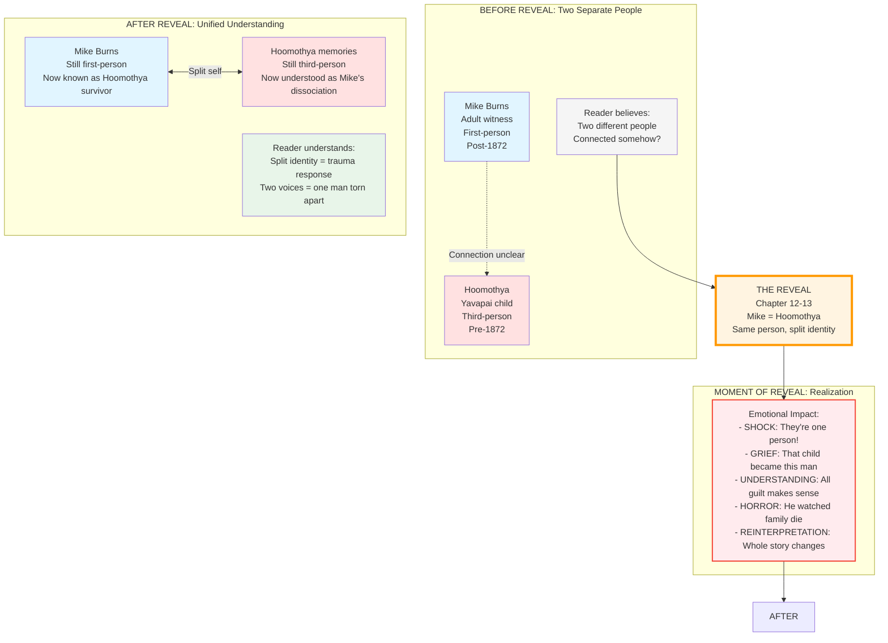
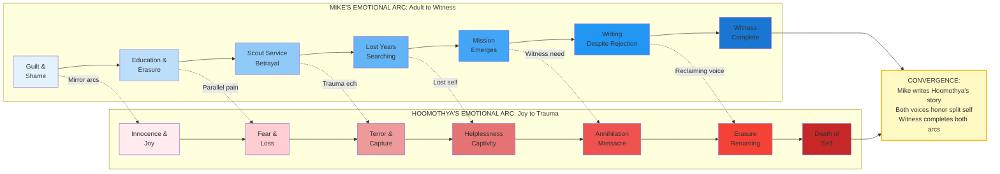
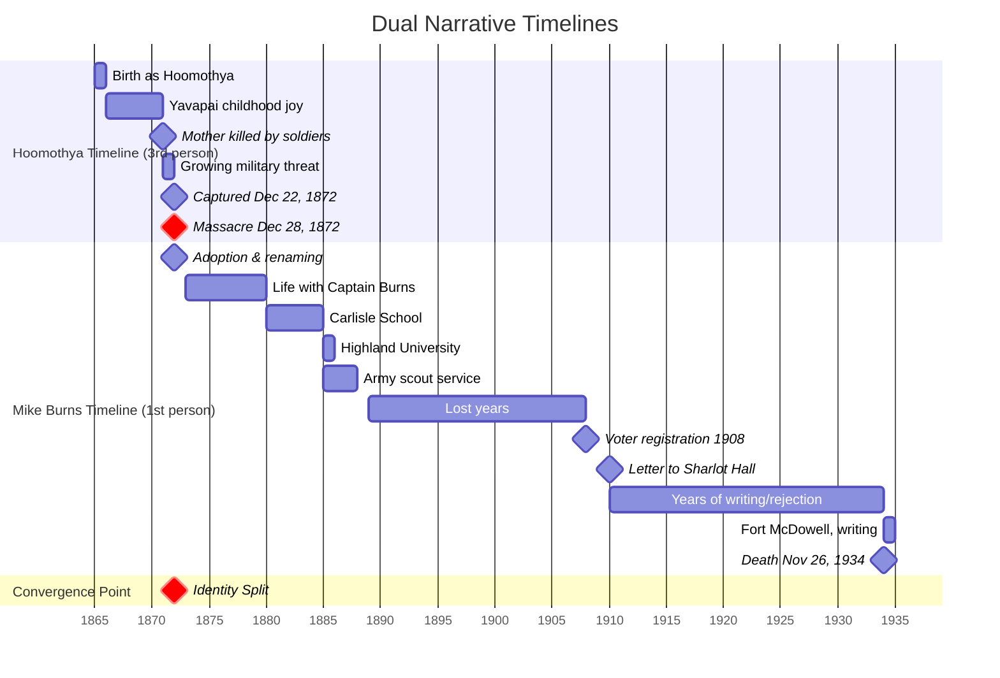
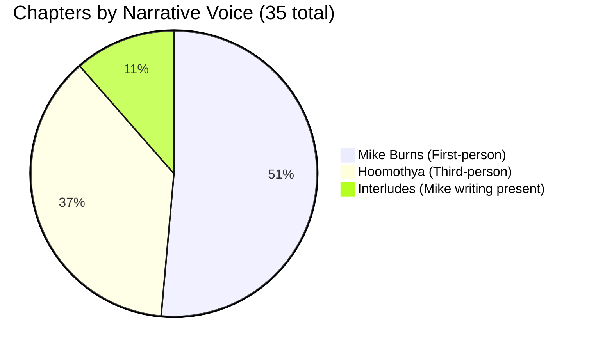
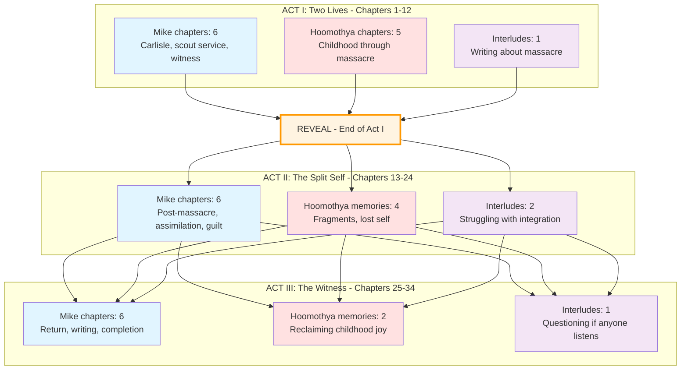
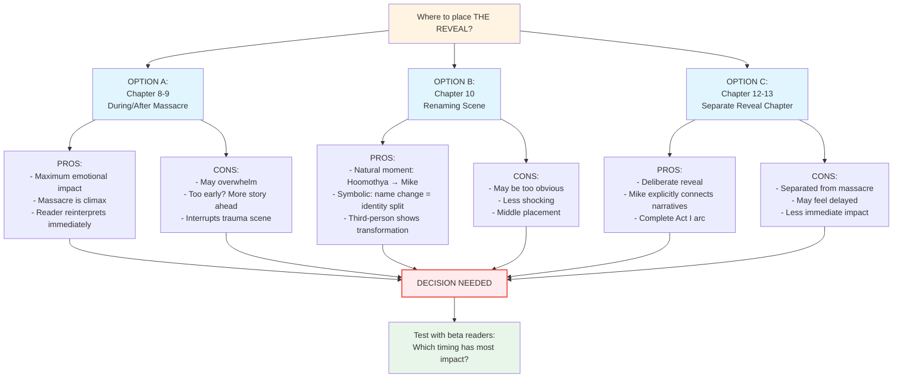
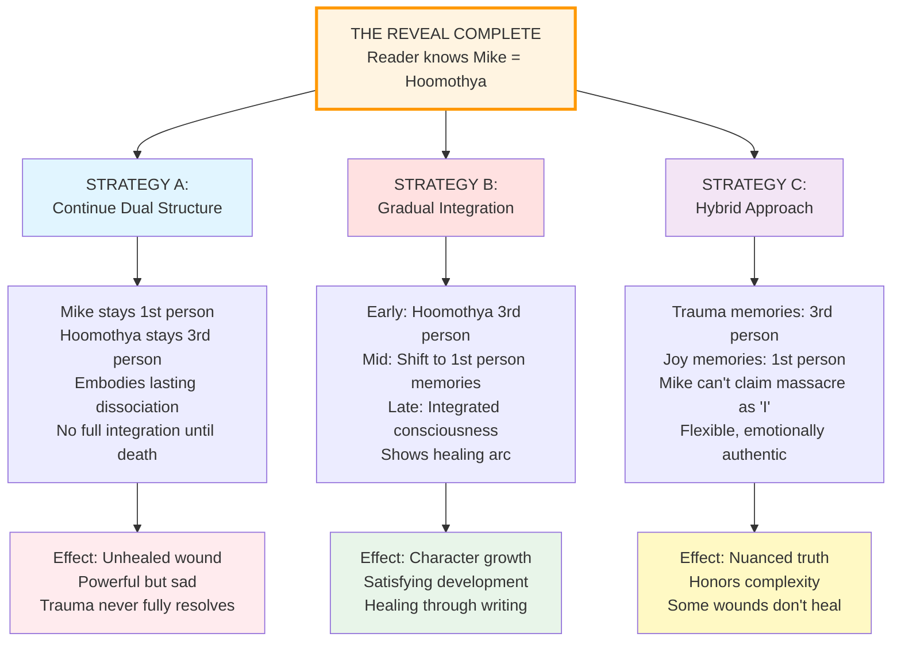
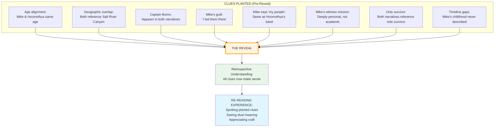
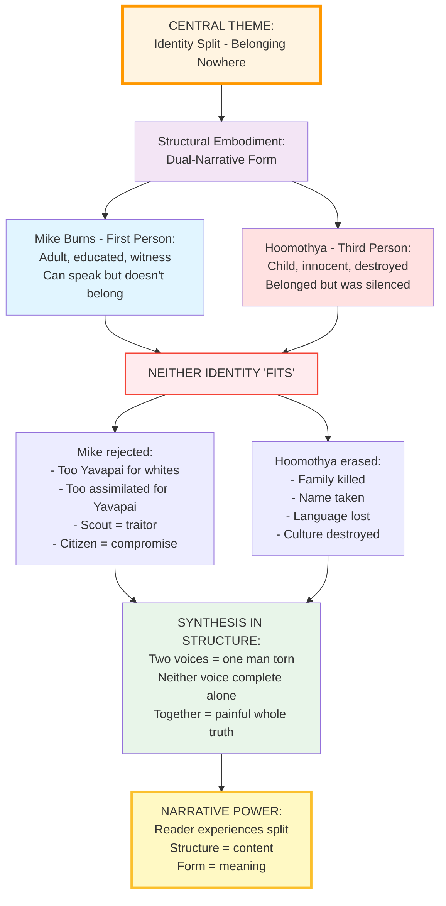

# Dual-Narrative Flow Diagrams

**Purpose**: Visual maps of the dual-narrative structure showing chapter interleaving, identity reveal, parallel arcs, and timeline convergence.

---

## DIAGRAM 1: CHAPTER INTERLEAVING PATTERN

```mermaid
graph TD
    PROL[PROLOGUE: Mike 1934 - Begins writing]
    PROL --> CH1[CH 1: MIKE - Adult witness, mission]
    CH1 --> CH2[CH 2: HOOMOTHYA - Yavapai childhood]
    CH2 --> CH3[CH 3: MIKE - Carlisle School]
    CH3 --> CH4[CH 4: HOOMOTHYA - Mother's death]
    CH4 --> CH5[CH 5: MIKE - Scout service begins]
    CH5 --> CH6[CH 6: HOOMOTHYA - Growing threat]
    CH6 --> CH7[CH 7: MIKE - Writing about massacre]
    CH7 --> CH8[CH 8: HOOMOTHYA - Journey to cave]
    CH8 --> CH9[CH 9: MIKE - Survivor's guilt]
    CH9 --> CH10[CH 10: HOOMOTHYA - Captured Dec 22]
    CH10 --> CH11[CH 11: MIKE - Identity reflection]
    CH11 --> CH12[CH 12: HOOMOTHYA - Massacre Dec 28]
    CH12 --> REV[THE REVEAL - They are one person]

    REV --> CH13[CH 13: MIKE - Post-massacre with Burns]
    CH13 --> CH14[CH 14: HOOMOTHYA memory - Aftermath]
    CH14 --> CH15[CH 15: MIKE - Scout moral weight]
    CH15 --> CH16[CH 16: HOOMOTHYA memory - Lost self]
    CH16 --> DOTS[...continuing pattern...]
    DOTS --> CH34[CH 34: MIKE - Final witness]
    CH34 --> EPIL[EPILOGUE: Truth survives]

    style PROL fill:#e1f5ff
    style CH1 fill:#e1f5ff
    style CH3 fill:#e1f5ff
    style CH5 fill:#e1f5ff
    style CH7 fill:#e1f5ff
    style CH9 fill:#e1f5ff
    style CH11 fill:#e1f5ff
    style CH13 fill:#e1f5ff
    style CH15 fill:#e1f5ff
    style CH2 fill:#ffe1e1
    style CH4 fill:#ffe1e1
    style CH6 fill:#ffe1e1
    style CH8 fill:#ffe1e1
    style CH10 fill:#ffe1e1
    style CH12 fill:#ffe1e1
    style CH14 fill:#ffe1e1
    style CH16 fill:#ffe1e1
    style REV fill:#fff4e1
    style CH34 fill:#e1f5ff
    style EPIL fill:#e1ffe1
```



**Legend**:
- 🔵 **Blue boxes**: Mike Burns chapters (first-person)
- 🔴 **Red boxes**: Hoomothya chapters (third-person)
- 🟡 **Yellow box**: The Reveal moment
- 🟢 **Green box**: Epilogue (integrated)

---

## DIAGRAM 2: IDENTITY REVEAL STRUCTURE



---

## DIAGRAM 3: PARALLEL EMOTIONAL ARCS CONVERGING



**Key Insight**: Mike's arc is REACTION to Hoomothya's arc. Every point of Mike's guilt/mission corresponds to Hoomothya's trauma/loss.

---

## DIAGRAM 4: DUAL TIMELINE TRACKS



**Timeline Explanation**:
- **Red (Critical) Bar**: The massacre—convergence point where Hoomothya ends and Mike begins
- **Hoomothya timeline** (1865-1872): Told in third-person, child perspective
- **Mike timeline** (1872-1934): Told in first-person, adult reflection
- **Novel structure**: Alternates between these timelines until reveal, then continues with both

---

## DIAGRAM 5: CHAPTER DISTRIBUTION BY ACT





**Pattern Notes**:
- **Act I**: Heavy alternation (establishing both narratives)
- **Act II**: Continues alternation (deepening complexity post-reveal)
- **Act III**: Mike-dominant (witness mission takes precedence, fewer Hoomothya flashbacks)

---

## DIAGRAM 6: REVEAL OPTIONS (Decision Points)



---

## DIAGRAM 7: POST-REVEAL INTEGRATION STRATEGIES



---

## DIAGRAM 8: READER EXPERIENCE JOURNEY

```mermaid
journey
    title Reader's Emotional Journey Through Dual Narrative
    section Act I: Confusion & Engagement
      Meet Mike: 5: Reader
      Meet Hoomothya: 5: Reader
      Alternating chapters: 4: Reader
      Sensing connection?: 6: Reader
      Growing investment: 7: Reader
      Massacre horror: 9: Reader
      THE REVEAL: 10: Reader
    section Act II: Reinterpretation & Depth
      Shock of realization: 10: Reader
      Re-seeing Mike's guilt: 9: Reader
      Understanding split self: 8: Reader
      Deepening empathy: 9: Reader
      Grasping full tragedy: 9: Reader
    section Act III: Resolution & Catharsis
      Mike's mission clear: 8: Reader
      Witness honored: 9: Reader
      Manuscript complete: 8: Reader
      Mike's death: 7: Reader
      Publication vindication: 10: Reader
```

**Emotional Intensity Scale**: 1 (low) to 10 (high)

---

## DIAGRAM 9: CLUES & FORESHADOWING MAP



---

## DIAGRAM 10: STRUCTURAL THEME EMBODIMENT



---

## USING THESE DIAGRAMS

### For Planning:
- Reference **Diagram 1** for chapter sequencing
- Use **Diagram 6** to decide reveal placement
- Use **Diagram 7** to choose post-reveal strategy

### For Writing:
- Check **Diagram 2** to maintain voice separation pre-reveal
- Reference **Diagram 3** to track parallel emotional arcs
- Use **Diagram 4** for timeline accuracy

### For Revision:
- Review **Diagram 9** to ensure clues are planted
- Check **Diagram 8** for reader experience pacing
- Use **Diagram 10** to verify theme embodiment

### For Consultation:
- Share **Diagram 10** with sensitivity readers to explain structural choice
- Use **Diagram 2** to show reveal impact
- Reference **Diagram 5** to show chapter distribution

---

**These diagrams will evolve as the structure is refined. They serve as visual guides for maintaining narrative coherence and emotional impact throughout the dual-narrative restructure.**
